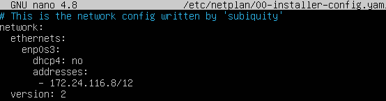
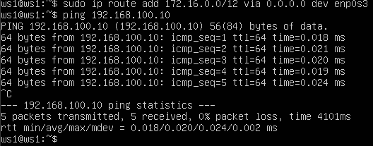
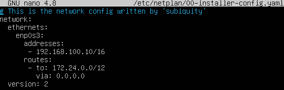
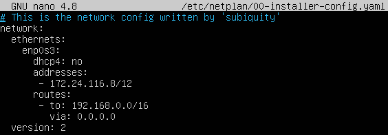
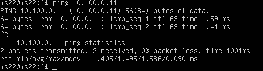
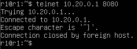

# DO2_LinuxNetwork

## Part 1. Инструмент ipcalc
**1. Сети и маски** 
- **Адрес сети 192.167.38.54/13:**  
```ipcalc 192.167.38.54/13```  
  
- **Перевод маски 255.255.255.0 в префиксную и двоичную запись, /15 в обычную и двоичную, 11111111.11111111.11111111.11110000 в обычную и префиксную:**  
```ipcalc 192.168.1.1 255.255.255.0```  
  
```ipcalc 192.168.1.1/15```  
  
- **Минимальный и максимальный хост в сети 12.167.38.4 при масках: /8, 11111111.11111111.00000000.00000000, 255.255.254.0 и /4:**  
```ipcalc 12.167.38.4/8```  
  
```ipcalc 12.167.38.4/16```   
16 = 11111111.11111111.00000000.00000000   
  
  
```ipcalc 12.167.38.4/255.255.254.0```  
  
```ipcalc 12.167.38.4/4```   
  

**2. localhost**  

- Локальные сети IPv4:  
10.0.0.0/8  
  
172.16.0.0/12  
  
192.168.0.0/16  
  
- Loopback:  
127.0.0.0/8  
 
- Проверим IP на localhost:  
    1. **194.34.23.100**  - не является, не входит ни в одну зону  
    2. **127.0.0.2**  - является, входит в зону в 127.0.0.0/8  
    3. **127.1.0.1**  - является, входит в зону в 127.0.0.0/8  
    4. **128.0.0.1**  - не является, не входит ни в одну зону  

**3. Диапазоны и сегменты сетей**  
- Минимальный и максимальный хост у сети **10.10.0.0/18**:  
  
- Проверим каждый возможный ip на шлюз сети **10.10.0.0/18**:  
    1. **10.0.0.1** - не является, первый октет подходит, а второй нет 10 != 0  
    2. **10.10.0.2** - является
    3. **10.10.10.10** - является
    4. **10.10.100.1** - не является, первые два октета подходят, а третий не входит в сеть, 0 < 63 < 100
    5. 10.10.1.255 - является

## Part 2. Статическая маршрутизация между двумя машинами
**Посмотрим существующие сетевые интерфейсы у ws1 и ws2:**  
- **ws1**  
  
- **ws2**  
  
**Изменим интерфейсы на обеих машинах:**  
- **ws1**  
  
- ws2  
  
**Выполним команду ```netplan apply``` для перезапуска сервиса сети:**  
- **ws1**  
  
- **ws2**  
   

**1. Добавление статического маршрута вручную и пингование между машинами:**  
- **ws1**  
  
- **ws2**  
  

**2. Добавление статического маршрута с сохранением**  
1. **Изменяем конфигурационный файл:**  
- **ws1**  
  
- **ws2**  
  
**1. Перезагружаем машины с помощью ```reboot``` и пингуем:**  
- **ws1**  
  
- **ws2**  
   


## Part 3. Утилита iperf3  
**1. Перевод скорости:**  
- 8 Mbps в MB/s: 8 / 8 = 1 MB/s  
- 100 MB/s в Kbps: 100 * 8 * 1000 = 800000 Kbps  
- 1 Gbps в Mbps: 1 * 1000 = 1000 Mbps

**2. Утилита iperf3:**
- Запуск сервера на ws2:  
    
- Запуск тестового соединения с помощью клиента на ws1:  
  

## Part 4. Сетевой экран
### **1. Утилита iptables**  
1. **Пропишем правила в файл, иметирующий фаервол**:
- ws1  
  
- ws2  
  
2. **Делаем файл исполняемым и запускаем его:**
- ws1  
  
- ws2  
  

### **2. Утилита nmap**  
1. **Проверка на пинг:**
- **с ws1 на ws2**  
  
- **с ws2 на ws1**  
  
2. **Проверка, что хост ws1 запущен:**  
  

## Part 5. Статическая маршрутизация сети

### 1. Настройка адресов машин
- **r1**  
  
**interfaces:**  
  

- **r2**  
  
**interfaces:**  
  

- **ws11**  
  
**interfaces:**  
  

- **ws21**  
  
**interfaces:**  
  

- **ws22**  
  
**interfaces:**  
  

- **ping ws22 с ws21**  
  

- **ping r1 с ws11**  
  

### 2. Включение переадресации IP-адресов
- **r1**  
**Применение команды ```sysctl -w net.ipv4.ip_forward=1```:**  
  
**Содержимое файла /etc/sysctl.conf:**  
  

- **r2**  
**Применение команды ```sysctl -w net.ipv4.ip_forward=1```:**  
  
**Содержимое файла /etс/sysctl.conf:**  
  

### 3. Установка маршрута по умолчанию  
- **ws11**  
  
- **ws21**  
  
- **ws22**  
  

- **ping ws11 с r2**  
  
- **Проверка, что пинг доходит**  
  

### 4. Добавление статических маршрутов
**Проверяем наличие статических маршрутов**  
- **r1**   
  
- **r2**  
  

### 5. Построение списка маршрутизаторов  
**Запустим на r1 команду ```tcpdump -tnv -i eth0```:**  
  
**При помощи утилиты traceroute построим список маршрутизаторов на пути от ws11 до ws21**  
  

**traceroute** работает по принципу от udp пакетов с увеличением внутри них ttl после каждого хопа до тех пор, пока не дойдет до места назначения. Если не может достигнуть своей цели, он ttl будет 0 и закончит отправку пакетов, возвращая в ответ ***  

### 6. Использование протокола ICMP при маршрутизации  
**Перехватываем сетевой трафик на r1 c помощью команды ```tcpdump -n -i eth0 icmp```:**  
  
**Пингуем несуществующий ip с ws11:**  
  


## Part 6. Динамическая настройка IP с помощью DHCP

### 1. **Настройка r2**  
**Пропишим правила выдачи ip в dhcpd.conf:**   
  

**resolv.conf пропиши nameserver 8.8.8.8:**  
  

**Перезагрузим сервис dhcp-server:**  
  

**Проверим выдачу ip для ws21:**  
  

**Пропингуем ws22 c ws21**  


### 2. **Настройка r1**
**Изменим mac-адрес ws11:**  
  

**Пропишим правила выдачи ip в dhcpd.conf:**   
   

**resolv.conf пропиши nameserver 8.8.8.8:**  
  

**Перезагрузим сервис dhcp-server:**  


**Проверим выдачу ip в ws11:**  


## Part 7. NAT  

1. **Cделаем сервер Apache2 общедоступным на ws22 и r1, изменив файл /etc/apache2/ports.conf:**  
- r1  
  
- ws22  
  

2. **Запустим веб-сервер Apache командой ```service apache2 start``` на ws22 и r1:**  
- r1  
  
- ws22  
  

3. **Добавим в фаервол правила в r2:**  
  

4. **Проверим все правила**  
**PS:** надо было добавить только первые три правила и проверить, что r1 не пингуется с ws22:  
  
**После этого мы разрешили проходить пакеты icmp с помощью команды ```iptables -A FORWARD -p icmp -j ACCEPT``` и проверили, что пинг проходит:**  
  
**Проверим работу SNAT и DNAT с помощью telnet:**  
    - r1 с ws22  
      
    - r2 с r1  
      
    - ws22 с r1  
      

## Part 8. Дополнительно. Знакомство с SSH Tunnels  

1. **Запустим на r2 фаервол с правилами:**  
  

2. **Запусти веб-сервер Apache на ws22 только на localhost:**  
  


3. **Подключимся по ssh c ws11:**  
  

4. **Подключимся по ssh c ws21:**  
  

5. **Для проверки, сработало ли подключение в обоих предыдущих пунктах, перейдем во второй терминал (например, клавишами Alt + F2) и выполнем команду:**  
  
